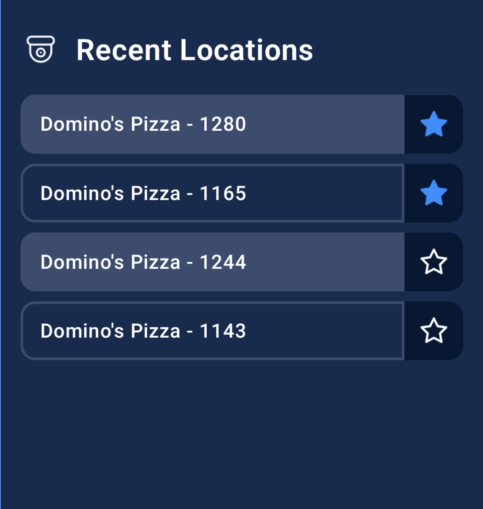

# Recruitment Task - List View Implementation

## Overview
This is a recruitment task designed to evaluate your coding skills, including code quality, design patterns, and best practices.

## Task Description
Create a list view based on the UI design provided in the `docs` folder. The list should dynamically fetch data from a given URL endpoint.

## Requirements

### UI Design


### Technology Stack
- **UI**: Implement using Jetpack Compose or XML layouts
- **Dependency Injection**: Koin
- **Networking**: Retrofit
- **Data**: Use mocked data for demonstration

### Implementation Guidelines
- Use appropriate design patterns
- Write clean, simple, and maintainable code
- Structure the code as if it were going into a production project
- Create proper data models
- Handle data mapping and transformation correctly

## Evaluation Criteria
- Proper use of design patterns
- Code simplicity and cleanliness
- Production-ready code quality
- Correct model implementation

## API Endpoint
**Target URL**: `https://example.com/api/recentLocations`

**Important**: The above URL is not currently working. However, you should:
1. Create a proper Retrofit API interface for this endpoint
2. Implement a mocking mechanism to return test data
3. Structure your code so that switching to the real API would be straightforward

## Functionalities

### Favorite Management
When a user taps the star icon to mark a location as favorite:
- **No API call should be made**
- When the user returns to the app, previously marked favorites should be displayed
- The local state should persist across app sessions

### Favorite Limit
- Users can mark a **maximum of 3 locations** as favorites
- When 3 locations are already marked as favorite, the star icon on unmarked locations should be hidden or disabled

## Example JSON Response
```json
[
  {
    "displayName": "Domino's Pizza - 1280",
    "isFavourite": true,
    "isActive": true
  },
  {
    "displayName": "Domino's Pizza - 1165",
    "isFavourite": true,
    "isActive": false
  },
  {
    "displayName": "Domino's Pizza - 1244",
    "isFavourite": false,
    "isActive": true
  },
  {
    "displayName": "Domino's Pizza - 1143",
    "isFavourite": false,
    "isActive": false
  }
]
